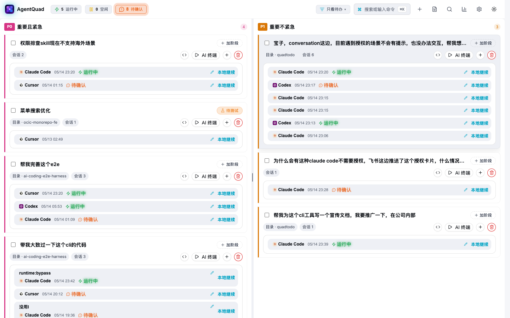
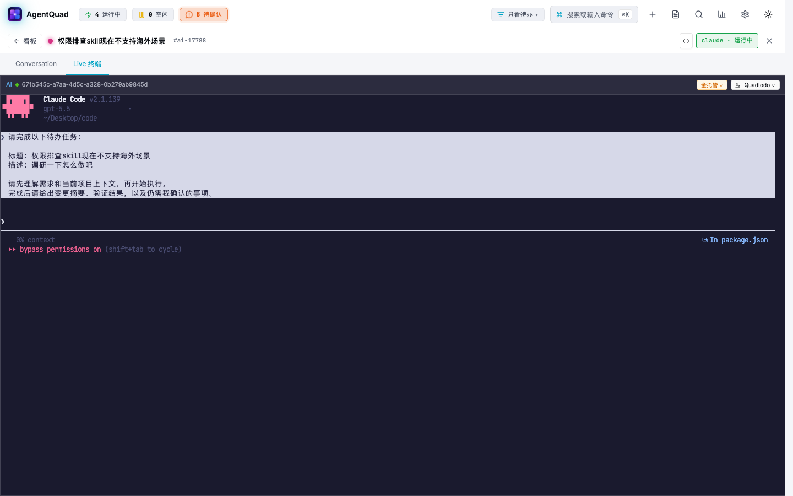
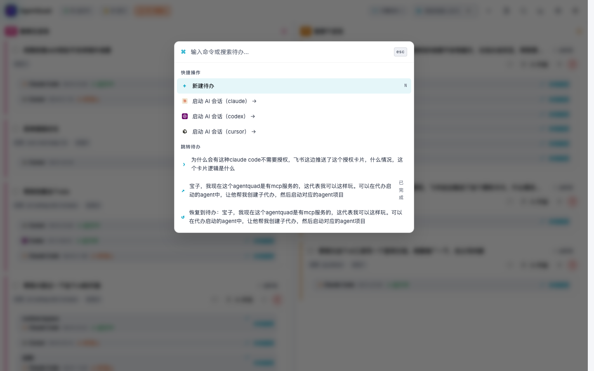
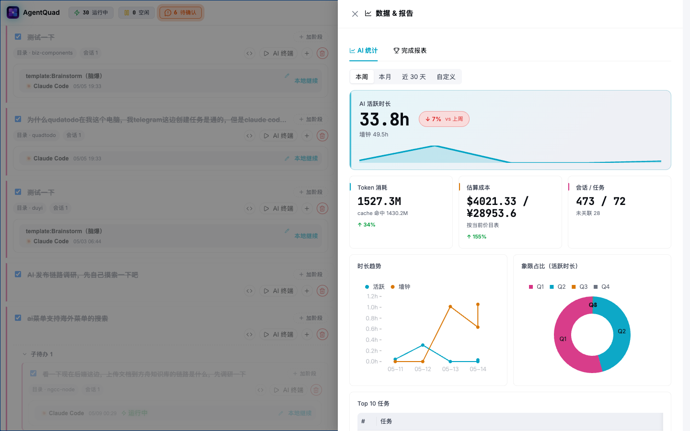

# AgentQuad —— 让 AI 待在任务卡里，而不是在另一个窗口

> 一个本地跑的四象限看板，每张 todo 卡片都能起一个 Claude Code / Codex / Cursor 终端会话。
> 全本地存储，原生 MCP，能跟飞书 / Telegram 串起来。

---

## 你现在是不是这样工作的

- 今天要做 6 件事，**记在 3 个地方**——飞书任务、Linear、桌面贴纸，最后哪个都不全；
- 跟 AI 改代码，**开了 4 个终端窗口**，一个 Claude，一个 Codex，再来一个跑测试，第 4 个忘了是干啥的；
- 周五写周报，**翻聊天记录翻得想哭**，"我这周 token 到底烧了多少"完全是黑盒；
- 一段长会话改一半被打断，**回头想接着干**——光找上次开到哪一步就 10 分钟。

如果命中两条以上，往下看。

---

## AgentQuad 是什么（一句话）

**把"做事"和"AI 助手"按任务捆在一起的本地调度器**——艾森豪威尔四象限管 todo，每张卡都能内嵌起一个 Claude Code / Codex / Cursor 会话，会话日志全部本地落盘，可恢复、可搜索、可统计。

它**不是**：

- 不是 Linear / Todoist —— 它们没法在卡片里直接跑 AI 终端；
- 不是 Cursor / Aider —— 它们没有任务管理和跨项目调度；
- 不是原生 Claude Code —— 它没有可视化看板、没有跨任务隔离、没有会话历史浏览。

它**是**那一层在中间、把工程师每天 80% 时间都待着的两个工具粘起来的胶水。

---

## 三个核心场景

### 1. 四象限看板：杂事一目了然



按"重要 × 紧急"分四格，跨象限拖拽。每张 todo 卡上直接显示挂在它上面的 AI 会话状态（运行中 / 待确认 / 已完成），状态出问题的卡片会有黄色徽章 —— **不用切窗口就知道哪条要回头看一眼**。

顶部三个 chip：运行中 / 空闲 / 待确认，点一下就过滤。

### 2. 每张卡 = 一个 Claude / Codex / Cursor 会话



这是 todo 卡片打开后的"Live 终端"视图 —— 真的就是 `claude` / `codex` / `cursor` 进程在跑，xterm.js 渲染，PTY 透传。Conversation tab 是从 Claude JSONL 日志解析出的"干净对话视图"，Live tab 是原始终端，要交互（比如批准工具调用）随时切。

跑到一半要离开？关掉浏览器再回来还在。30 分钟空闲会清理 PTY，但 JSONL 日志全在，**点"恢复会话"接着聊**。

**最近上线的"嵌套子 agent"**：父 todo 里跑的 Claude，可以通过 MCP 工具帮你**创建子 todo + 启动对应的 Claude/Codex/Cursor 会话**，形成任务树。复杂工作拆解到 AI 自己接力跑，你只看树的顶端。

### 3. ⌘K + 统计周报

<table>
<tr>
<td></td>
<td></td>
</tr>
<tr>
<td align="center"><sub>⌘K 命令面板 —— 新建 / 跳转 / 启动会话 / 切视图</sub></td>
<td align="center"><sub>统计 & 报告 —— AI 活跃时长、Token 消耗、估算成本、象限分布</sub></td>
</tr>
</table>

右图那个"周报 view"是真实数据：**本周 33.8h AI 活跃时长、1.5B token、估算 ¥28953 成本**，象限占比一眼看出"这周到底花在重要紧急 vs 重要不紧急"。模型单价可配置，团队内部模型用自定义价表算就行。

---

## 30 秒上手

```bash
npm install -g agentquad
agentquad                  # 默认开 http://127.0.0.1:5677
```

环境：Node 20+，macOS / Linux。

第一次启动会引导你装 `claude` / `codex`，或者自己手动：

```bash
agentquad install-tools --all
# 等价于：npm i -g @anthropic-ai/claude-code @openai/codex
```

任何时候排查：

```bash
agentquad doctor          # 一行命令把环境 / 配置 / 活跃会话全过一遍
```

---

## 字节内部怎么用

### 用公司内部的 claude / codex wrapper

AgentQuad 不强写死可执行文件名。你公司内的 `claude-w` / `codex-w` / `cursor-w` 之类的封装层，直接配进去就行：

```bash
agentquad config set tools.claude.command claude-w
agentquad config set tools.codex.command  codex-w
# 或绝对路径
agentquad config set tools.claude.bin /opt/internal/bin/claude-w
```

`command` 走 PATH，`bin` 是绝对路径（优先级高）。两个都能配多家 AI 工具，互不影响。

### 内网 / 合规 / 不暴露公网

> ⚠️ AgentQuad 内置 shell + AI 终端能力，**不要直接绑公网 IP**。

推荐姿势：

- **本机用**：默认 `127.0.0.1:5677`，零配置；
- **手机用**：装 Tailscale，把电脑加进自己的 tailnet，`agentquad config set host 0.0.0.0` 让它监听所有网卡。手机走 100.x 私有 IP 直连 ——
  → 详见 `docs/MOBILE.md`；
- **绝对不要** `--expose` 公网 + 不要 0.0.0.0 上线到公司外网。

数据：所有 todo / 会话 / 日志都在 `~/.agentquad/`，SQLite + JSONL 文件，整个目录打包就是导出，**没有任何云端**。

### 飞书集成

仓库里有 `docs/LARK.md`，已经把"发消息 / 富文本卡片 / 待办通知"那一套接好。配合内部 Lark bot token，可以：

- 每条 todo 状态变化推到飞书私信 / 群；
- AI 卡到"待确认"决策点（比如 Claude 想 `rm -rf` 或调危险 MCP），飞书 push 一个按钮卡片，你在手机上点"允许"它就接着跑。

### Telegram 模式（如果你海外/外发场景多）

Telegram supergroup + forum topic：每个 task 一个 topic，对话物理隔离，结束自动 close。海外团队用很爽，国内默认走飞书就好。

→ 详见 `docs/TELEGRAM.md`

---

## 还有一些"懒人友好"细节

- **跨平台**：macOS / Linux，Windows 计划中；
- **冷启动 < 1s**：Express + SQLite，没有 Electron 没有 Docker；
- **MCP 服务内置**：`POST /mcp`，17 个工具，外部 Claude Code 挂上来可以用自然语言"帮我清理重复 todo" / "最近一周我在忙啥" / "合并这三条登录相关的"；
- **会话恢复**：JSONL 日志驱动，关电脑、断网、kill 进程都能找回；
- **`agentquad doctor`**：一键自检环境，环境问题 80% 它能直接定位。

---

## 下一步

```bash
npm install -g agentquad && agentquad
```

如果跑起来了发现卡片里 Claude 真在跑，恭喜，你已经在我们群里能正常聊天了 :)

- 飞书共建群：<TODO: 填群名 / 二维码>
- 反馈直接拍：<TODO: 填飞书 ID>
- 提 issue / PR：<https://github.com/LIUZHENHUA521/agentquad>
- 如果觉得有用，**点个 ⭐ 比"已读"管用很多**，毕竟开源项目维护者也是人。

---

<sub>项目历史：最早叫 `quadtodo`，v0.3.0 改名 `agentquad`，老命令 `quadtodo` 仍作为别名保留。当前版本 v0.4.2。</sub>
