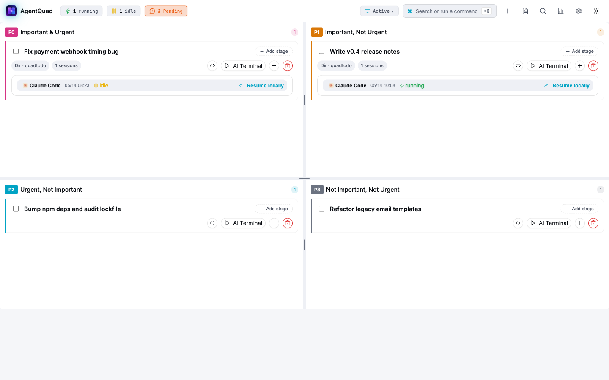
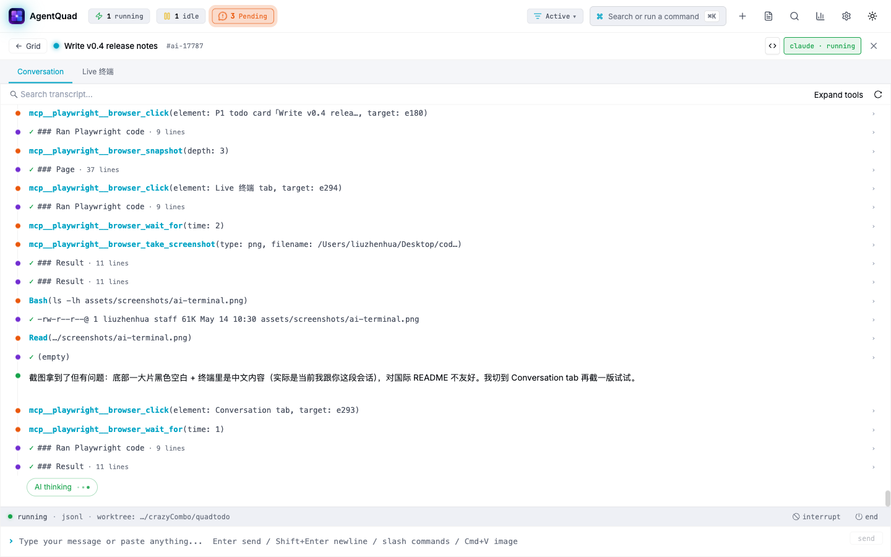

# 飞书远程驱动 AgentQuad — 新人上手教程

> 这篇文档把"装 AgentQuad → 配 AI 工具 → 配飞书 → 在飞书群 @bot 让 Claude 帮你写代码"串成一条完整路径。
>
> 看完之后，你会得到一个**完整的开发体验**：人在外面，用飞书发一句话，本地 Claude/Codex 就在你的仓库里干活、再把过程同步回飞书 thread。
>
> 配置参考手册：[docs/LARK.md](./LARK.md)（本文不重复，需要细节时跳过去看）。

预计耗时：**20 分钟**。

---

## 你将得到的最终效果

在飞书话题群里 @bot 发一句：

```
@agentquad 帮我做：在当前仓库里写一个 nodejs hello world demo
```

接下来发生的事：

1. bot 反问你选哪个工作目录
2. 选完后，bot 在话题群里开一个 thread，本地 Claude Code 在这个目录里开工
3. AI 全部输出（思考、命令、文件改动）实时同步到 thread
4. 卡到要授权的地方（写文件 / 跑命令），bot 在 thread 里推卡片让你点同意/拒绝
5. 任务完成，bot 把 thread 标记 ✅

> 📷 截图占位 —— **飞书话题群里 @bot 跑完一次任务的完整对话截图**
>
> _（这张截图由你本人在飞书侧手动补，放到 `assets/screenshots/lark-tutorial-demo.png`，然后把下行替换成图片引用）_
>
> ``

---

## 前置条件

- macOS 或 Linux（Windows 暂不支持）
- Node.js **20+**，npm **10+**
- 一个飞书账号；如果是企业版需要管理员有"创建自建应用"权限
- 一台**长期开机**的电脑跑 AgentQuad（你 @bot 时这台机得在线）

> 这套方案是**全本地**的：AI 在你本地跑，飞书只做远程触发和消息中转。没有公网回调地址，不暴露端口。

---

# 第 1 部分 · 安装 AgentQuad

## 1.1 装包

```bash
npm install -g agentquad
```

装完之后会有两个等价的 CLI 命令：`agentquad` 和 `quadtodo`（老名字别名，保留兼容）。

## 1.2 启动

```bash
agentquad
```

第一次跑会引导你装 `claude` / `codex`（下一节会细讲）。如果想跳过向导直接进面板：

```bash
agentquad --no-wizard
# 或者环境变量 AGENTQUAD_SKIP_WIZARD=1
```

启动成功后会自动在浏览器打开 <http://127.0.0.1:5677>，看到四象限看板：

> 📷 截图：四象限看板首屏
>
> 

## 1.3 自检

任何时候卡住，先跑这条：

```bash
agentquad doctor
```

它会逐项检查 Node 版本、依赖、`claude` / `codex` 是否在 PATH 里、配置文件是否合法。

---

# 第 2 部分 · 在设置抽屉里配 AI 工具（claude + codex）

AgentQuad 本身**不内置任何 AI 模型**，它只是一个调度器，把每条 todo 挂到本地的 `claude` 或 `codex` CLI 上。所以下一步是装 + 登录这两个 CLI，并告诉 AgentQuad 它们在哪里。

## 2.1 装 claude + codex

一键装齐：

```bash
agentquad install-tools --all
```

或者手动：

```bash
npm i -g @anthropic-ai/claude-code @openai/codex
```

装完验证：

```bash
which claude && which codex
claude --version
codex --version
```

## 2.2 各自登录一次

每个 CLI 都需要先单独登录一次（用浏览器 OAuth 或 API key，按各自的提示走）：

```bash
claude              # 进交互模式后按提示登录
codex               # 同上
```

登录信息存在 `~/.claude` / `~/.codex`，AgentQuad 不接触这些凭证，只是调用 CLI。

## 2.3 在 Web 控制台打开设置抽屉

回到 <http://127.0.0.1:5677>，**右上角齿轮图标** → 打开"设置"抽屉 → **"通用 / 工具"** Tab。

你能在里面调：

- **默认工具**：新建 todo 时挂哪个 CLI（`claude` / `codex` / `cursor-agent`）
- **每个工具的命令名**（`tools.claude.command`）：如果你装的是 `claude-w` 这种公司内 wrapper，改这个字段
- **每个工具的绝对路径**（`tools.claude.bin`）：优先级高于 `command`；多版本切换用得上
- **默认工作目录**：新建 todo 时默认 cd 进哪个目录

> 📷 截图占位 —— **设置抽屉 → 通用 / 工具 tab**
>
> _（请你打开 <http://127.0.0.1:5677> → 齿轮 → "通用"Tab，截一张，命名 `lark-tutorial-settings-ai.png` 放到 `assets/screenshots/`）_
>
> ``

绝大多数人**啥都不用改**，默认 `claude` + 系统 PATH 就行。改完点右上角"保存"。

## 2.4 起一条 todo 验证 AI 工具能跑

在四象限看板上随手新建一条 todo，比如 _"hello world 测试"_，点进去 → **"启动 AI 终端"** → 你会看到内嵌的 Claude 终端跑起来。

> 📷 截图：内嵌 AI 终端
>
> 

让它写个 hello world 试试：

```
帮我在这个目录写一个 hello.js，console.log("hello")，然后 node hello.js 跑一下
```

如果能完整跑通（看到 `hello` 输出），第 2 部分就完成了。

> 如果跑不起来：`agentquad doctor` 看哪一项 ✗，再回去对照 [README 故障排除](../README.zh-CN.md#故障排除)。

---

# 第 3 部分 · 配飞书

到这一步你已经有了"本地能跑 AI 的看板"。第 3 部分要做的是：**让飞书群里 @bot 也能远程触发同样的体验**。

> 这一节是**摘要 + 跳转**的体裁。每一步详细截图和踩坑详解全在 [docs/LARK.md](./LARK.md)，本文只串骨架。

## 3.1 在飞书开放平台建一个自建应用

- 国内版：<https://open.feishu.cn/app> · 国际版 Lark：<https://open.larksuite.com/app>
- **创建应用** → **企业自建应用** → 起名 `agentquad`（随意）
- 创建完进入应用后台，**凭证与基础信息** 页拿到 **App ID**（`cli_xxxx`）和 **App Secret**

## 3.2 给应用配权限

进 **权限管理** 开通这几项（详见 [LARK.md §2](./LARK.md#2-给应用配置必需的权限scope)）：

| Scope | 用途 |
|---|---|
| `im:message:send_as_bot` | 以应用身份发消息 |
| `im:message` | 接收 / 读取消息 |
| `im:message.reaction` | 表情回应（标任务状态） |
| `im:chat` | 获取群信息 |
| `im:resource` | 接收图片附件 |

开完 **右上角 → 创建版本 → 申请发布**（不发布权限不生效）。

## 3.3 启用事件订阅（长连接，无需公网）

**事件与回调** → **事件订阅**：

- 订阅方式选 **长连接**（重要 —— 不是 webhook）
- 添加事件：勾上 `im.message.receive_v1` 和 `card.action.trigger`

> ⚠️ 易踩坑：如果想在群里**直接发消息**就让 bot 收到（而不是必须 @bot 或长按回复），在 `im.message.receive_v1` 的"订阅范围"里改成"群组所有消息"。完整说明在 [LARK.md §3](./LARK.md#3-启用事件订阅长连接无需公网)。

## 3.4 建话题群并把 bot 加进去

- 飞书客户端 → **新建群 → 话题群**（注意必须是话题群，普通群无法做 thread 隔离）
- 群设置 → 添加成员 → 搜你的应用名 → 加进来

## 3.5 拿到 chat_id

最简单：先把后面的 6.1 跑起来（即使凭证填错也没关系），然后到群里 @bot 发一条消息。AgentQuad 的 log 里会打：

```
[lark-event] receive_v1 chat=oc_xxxxxxxxxxxxxxxxxxxx user=ou_xxx text=...
```

那个 `oc_xxxx` 就是 chat_id。

## 3.6 在 AgentQuad Web 抽屉里填上

回到 <http://127.0.0.1:5677> → 齿轮 → **"飞书 / Lark"** Tab：

| 字段 | 填什么 |
|---|---|
| **启用 Lark / 飞书通知** | ON |
| **App ID** | 3.1 拿到的 `cli_xxx` |
| **App Secret** | 3.1 拿到的 secret |
| **话题群 Chat ID** | 3.5 拿到的 `oc_xxx` |
| **要求目标群为话题群** | 保持开启 |
| **启用事件订阅** | ON（让 @bot 能反向触发） |
| **Web/CLI 起 session 自动镜像到 Lark thread** | ON |
| **默认权限模式** | 远程驱动推荐 **完全托管（bypass）**，否则等授权会卡 |

填完点 **测试** 按钮，应该看到 `✓` 成功提示。然后右上角 **保存**。

> 📷 截图占位 —— **设置抽屉 → 飞书 / Lark tab**
>
> _（请你在配置完成后截一张，**记得把 App Secret 这种敏感字段裁掉或打码**，命名 `lark-tutorial-settings-lark.png` 放到 `assets/screenshots/`）_
>
> ``

---

# 第 4 部分 · 端到端跑通一次

## 4.1 看 log 确认连上了

保存后回到启动 AgentQuad 的终端，应该看到：

```
[lark] bot started; chatId=oc_xxx eventSubscribe=on
[lark-event] websocket connected
```

如果一直没有 `websocket connected`，去 `~/.agentquad/logs/agentquad.log` 看错误（搜 `[lark`）。

## 4.2 在飞书群里 @bot

在你的话题群里发：

```
@agentquad 帮我做：在 ~/code/sandbox 里写一个 nodejs hello world demo
```

预期一连串：

1. bot 回复 "📁 选个工作目录…"（如果消息里没明确指定目录）
2. 选完后，bot 开一个 thread / 子话题
3. Claude Code 在这个目录里启动，输出实时同步到 thread
4. 需要写文件 / 跑命令时，bot 在 thread 里推卡片让你点
5. 任务结束，bot 标记 ✅

> 📷 截图占位 —— **完整对话截图：从 @bot 一句话到任务完成**
>
> _（在飞书侧截图后放到 `assets/screenshots/lark-tutorial-flow.png`）_
>
> ``

## 4.3 在 Web 看板里同时观察

打开 <http://127.0.0.1:5677>，你会看到刚刚那条任务也出现在四象限看板上 —— **Web 端和飞书是同一份数据**，session 是同一个，AI 输出双向同步。你可以在 Web 里直接接管这条 todo 的终端，飞书侧也能看到接下来的输出。

这就是文档开头说的"完整开发体验"。

---

## 故障排查（精简版）

完整版见 [LARK.md 常见问题](./LARK.md#常见问题)。

| 症状 | 第一步检查 |
|---|---|
| 测试按钮通过，但 @bot 没反应 | 事件订阅没开 / 没勾 `im.message.receive_v1` / 应用没发布版本 |
| 第一条 @bot 有反应，向导第二步发 `1` / `2` 没反应 | 订阅范围只覆盖了"@机器人 和 回复机器人"，要改成"群组所有消息"并重新发布 |
| log 里 `lark_credentials_missing` | App ID/Secret 没填 |
| log 里 `lark_send_failed: ... robot ... not in chat` | bot 没加进群 |
| `不是话题群`错误 | 用的是普通群；换成话题群，或关掉"要求话题群"开关 |

排查万能命令：

```bash
agentquad doctor                                # lark 段应全 ✓
tail -100 ~/.agentquad/logs/agentquad.log | grep '\[lark'
```

---

## 下一步

跑通飞书之后，可以再叠几个增强：

- **[docs/MCP.md](./MCP.md)** — 把 AgentQuad 接到任何 MCP-aware 的 Claude session 里（"帮我把这周所有 todo 合并成周报"）
- **[docs/TELEGRAM.md](./TELEGRAM.md)** — Telegram 远程驱动，思路类似但用 Telegram 而不是飞书
- **[docs/OPENCLAW.md](./OPENCLAW.md)** — 微信渠道（通过 OpenClaw 桥接）
- **[docs/MOBILE.md](./MOBILE.md)** — 用 Tailscale 让手机也能开 Web 控制台

---

<sub>有问题先翻 [docs/LARK.md](./LARK.md) 参考手册，再不行去 GitHub Issues。</sub>
